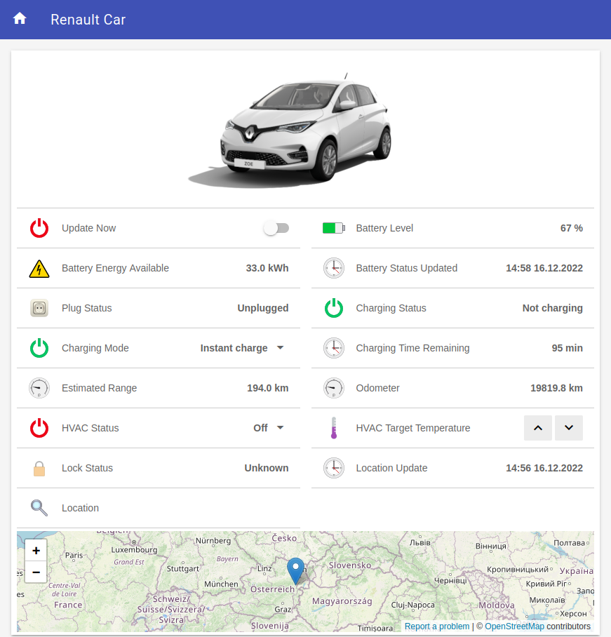

# Renault Binding

This binding allows MyRenault App. users to get battery status and other data from their cars. 
They can also heat their cars by turning ON the HVAC status and toggle the car's charging mode.

The binding translates the [python based renault-api](https://renault-api.readthedocs.io/en/latest/) in an easy to use openHAB java binding. 


## Supported Things

Supports MyRenault registered cars with an active Connected-Services account.

This binding can only retrieve information that is available in the MyRenault App.


## Discovery

No discovery


## Thing Configuration

You require your MyRenault credential, locale and VIN for your MyRenault registered car.

| Parameter         | Description                                                                | Required |
|-------------------|----------------------------------------------------------------------------|----------|
| myRenaultUsername | MyRenault Username.                                                        | yes      |
| myRenaultPassword | MyRenault Password.                                                        | yes      |
| locale            | MyRenault Location (language_country).                                     | yes      |
| vin               | Vehicle Identification Number.                                             | yes      |
| refreshInterval   | Interval the car is polled in minutes.                                     | no       |
| updateDelay       | How long to wait for commands to reach car and update to server in seconds.| no       |


## Channels

Some channels may not work depending on your car and MyRenault account. 
The "Advanced" channels are especially likely to cause confusion and problems.

| Channel ID             | Type               | Description                                     | Read Only |
|------------------------|--------------------|-------------------------------------------------|-----------|
| batteryavailableEnergy | Number:Energy      | Battery Energy Available                        | Yes       |
| batterylevel           | Number             | State of the battery in %                       | Yes       |
| chargingmode           | String             | Charging mode. always_charging or schedule_mode | No        |
| chargingstatus         | String             | Charging status                                 | Yes       |
| chargingremainingtime  | Number:Time        | Charging time remaining                         | Yes       |
| plugstatus             | String             | Status of charging plug                         | Yes       |
| estimatedrange         | Number:Length      | Estimated range of the car                      | Yes       |
| odometer               | Number:Length      | Total distance travelled                        | Yes       |
| hvacstatus             | String             | HVAC status HVAC Status (ON, OFF, PENDING)      | No        |
| hvactargettemperature  | Number:Temperature | HVAC target temperature (19 to 21)              | No        |
| externaltemperature    | Number:Temperature | Temperature outside of the car                  | Yes       |
| image                  | String             | Image URL of MyRenault                          | Yes       |
| location               | Location           | The GPS position of the vehicle                 | Yes       |
| locationupdated        | DateTime           | Timestamp of the last location update           | Yes       |


## Example

renaultcar.sitemap:

```
sitemap renaultcar label="Renault Car" {
    Frame {
        Image item=RenaultCar_ImageURL
        Default item=RenaultCar_BatteryLevel icon="batterylevel"
        Default item=RenaultCar_BatteryEnergyAvailable icon="energy"
        Default item=RenaultCar_PlugStatus icon="poweroutlet"
        Default item=RenaultCar_ChargingStatus icon="switch"
        Selection item=RenaultCar_ChargingMode mappings=[schedule_mode="Schedule mode",always_charging="Always charging"] icon="switch"
        Default item=RenaultCar_ChargingTimeRemaining icon="time"
        Default item=RenaultCar_EstimatedRange
        Default item=RenaultCar_Odometer
        Selection item=RenaultCar_HVACStatus mappings=[ON="ON"] icon="switch"
        Setpoint item=RenaultCar_HVACTargetTemperature minValue=19 maxValue=21 step=1 icon="temperature"
        Default item=RenaultCar_LocationUpdate icon="time"
        Default item=RenaultCar_Location
    }
}
```



If you do not have a smart charger and want to limit the charge of the battery you can set up an  active 15 minute charge schedule in the MyRenault App.
Then create a Dimmer item "RenaultCar_ChargeLimit" and set it to 80% for example. This rule will change the RenaultCar_ChargingMode to schedule_mode when the limit is reached.
This stops charging after the battery level reaches the charge limit.

ChargeRenaultCarLimit Code

```
configuration: {}
triggers:
  - id: "1"
    configuration:
      itemName: RenaultCar_BatteryLevel
    type: core.ItemStateUpdateTrigger
  - id: "3"
    configuration:
      itemName: RenaultCar_ChargeLimit
    type: core.ItemStateUpdateTrigger
  - id: "4"
    configuration:
      itemName: RenaultCar_PlugStatus
    type: core.ItemStateUpdateTrigger
conditions: []
actions:
  - inputs: {}
    id: "2"
    configuration:
      type: application/vnd.openhab.dsl.rule
      script: >-
        if ( RenaultCar_PlugStatus.state.toString == 'PLUGGED' ) {
          if ( RenaultCar_BatteryLevel.state as Number >= RenaultCar_ChargeLimit.state as Number ) {
            if (RenaultCar_ChargingMode.state.toString == 'always_charging' ) {
              RenaultCar_ChargingMode.sendCommand("schedule_mode")
            }
          } else {
            if (RenaultCar_ChargingMode.state.toString == 'schedule_mode' ) {
              RenaultCar_ChargingMode.sendCommand("always_charging")
            }
          }
        }
    type: script.ScriptAction

```
